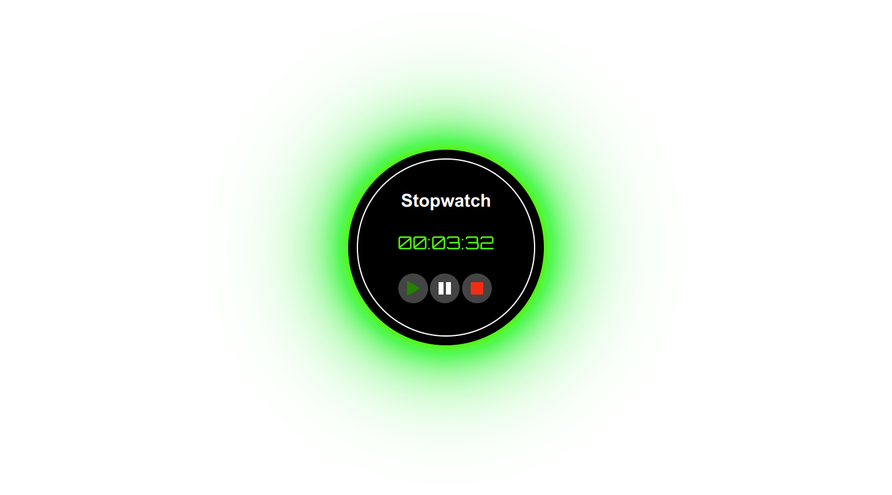

# Digital Stopwatch

## Table of contents

  - [Screenshot](#screenshot)
  - [Links](#links)
- [My process](#my-process)
  - [Built with](#built-with)
- [Author](#author)

### Screenshot

### Links

- Solution URL: [https://github.com/techanthere/100-days-of-code-challenge/tree/main/Day-0](https://github.com/techanthere/100-days-of-code-challenge/tree/main/Day-01)
- Live Site URL: [https://stopwatch-with-js.vercel.app/](https://stopwatch-with-js.vercel.app/)

## My process

### Built with

- Semantic HTML5 markup
- CSS custom properties
- CSS Grid

## Author

- Twitter - [@techanthere](https://www.twitter.com/techanthere)
